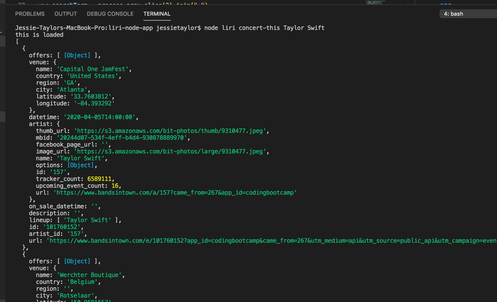

# liri-node-app

Jessie Taylor: Developer

Link to github repository: https://github.com/Jessiejtaylor/liri-node-app

Search Spotify for songs, Bands in town for concerts and OMBD for movies. Have Fun.

<b>How To Use:</b>

Use node to run this program. Use node liri.js then run one of the following comands, then add search text:

<b>concert-this</b> 
- <command, artist name> 
- Uses the bandsintown API to take a band name from the user and returns that bands next concert

<b>spotify-this-song</b> 
- <command, song name> 
- Uses the spotify API to take a song name from the user and returns the artist, song name, spotify-link and album

<b>movie-this</b> 
- <command, movie name> 
- Uses the OMDB API to take a movie name and returns the name, cast, release year, IMDB and Rotten Tomatoes rating, country of origin, language and plot)

<b>do-what-it-says</b> 
- < command >
- Uses the built in readFile() method to access data from a prepopulated .txt file and return its information as a command/search query.)

<b>When running a command follow it by desired text/search:</b> 
Example: node liri.js movie-this Miss Congeniality

<b>When concert-this command is used you will be provided with:</b> 
- Name of the venue
- Venue location
- Date of the Event

<b>When spotify-this-song command is used you will be provided with:</b> 
- Artist(s) 
- The song's name 
- A preview link of the song from Spotify 
- The album that the song is from 
- If no song is provided then your program will default to "The - Sign" by Ace of Base.

<b>When movie-this command is used you will be provided with:</b> 

- Title of the movie 
- Year the movie came out 
- IMDB Rating of the movie 
- Rotten Tomatoes Rating of the movie 
- Country where the movie was produced 
- Language of the movie 
- Plot of the movie 
- Actors in the movie 
- If the user doesn't type a movie in, the program will output data for the movie 'Mr. Nobody 

<b>When do-what-it-says command:</b>

A random.txt file with search for spotify-this-song "I want it that way." This will give you the spotify results of "I want it that way."

<b>Technologies Used:</b> 
- JavaScript 
- Node.js 
- Spotify API 
- Bands in Town API 
- OMDB API 
